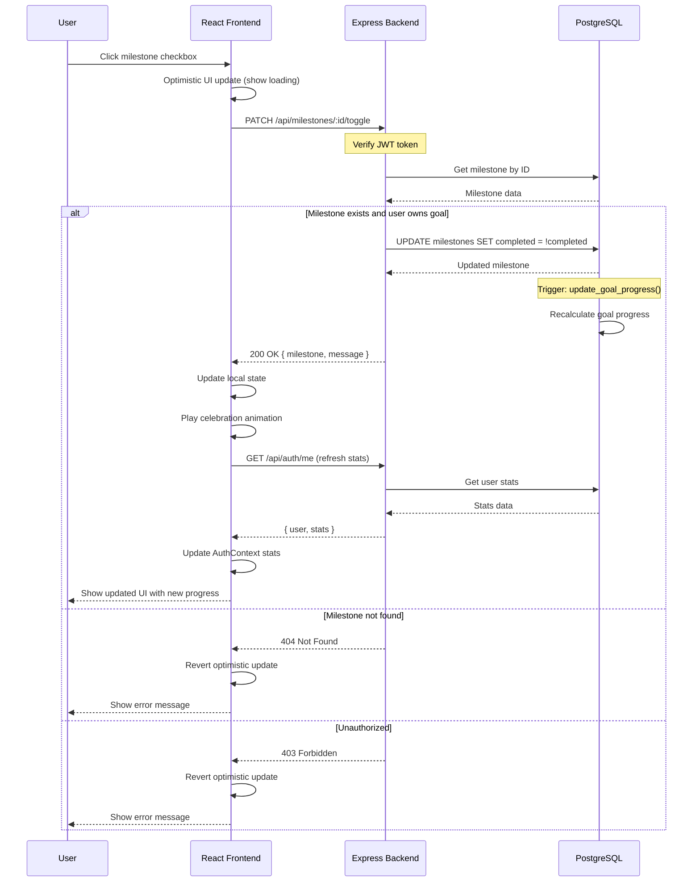

# Design Artifact: Milestone Completion Sequence Diagram

## Overview

This document describes the sequence of operations when a user marks a milestone as complete in the Learning Progress Tracker application.

## Sequence Diagram (Mermaid)



## Component Interaction Flow

### 1. User Action
- User clicks the checkbox button next to a milestone
- The `handleToggleMilestone` function in `GoalDetail.jsx` is triggered

### 2. Frontend Processing
```javascript
const handleToggleMilestone = async (milestoneId) => {
  try {
    // Track previous completion state
    const milestone = goal.milestones.find(m => m.id === milestoneId)
    const wasCompleted = milestone.completed
    
    // Make API call
    await milestonesApi.toggle(milestoneId)
    
    // Show celebration if completing
    if (!wasCompleted) {
      setCelebratingMilestone(milestoneId)
      setTimeout(() => setCelebratingMilestone(null), 1000)
    }
    
    // Refresh data
    await fetchGoal()
    refreshStats()
  } catch (error) {
    console.error('Failed to toggle milestone:', error)
  }
}
```

### 3. API Request
- HTTP Method: `PATCH`
- Endpoint: `/api/milestones/:id/toggle`
- Headers: `Authorization: Bearer <JWT>`

### 4. Backend Processing
1. **Authentication Middleware**
   - Validates JWT token
   - Extracts user ID from token
   
2. **Authorization Check**
   - Queries milestone to get goal_id
   - Checks if goal belongs to authenticated user

3. **Database Update**
   - Toggles the `completed` field
   - Sets/clears `completed_at` timestamp
   - Database trigger automatically recalculates goal progress

### 5. Response & UI Update
- Success: Returns updated milestone data
- Frontend updates local state
- Celebration animation plays (CSS keyframe animation)
- User stats are refreshed in AuthContext

## Database Trigger

The PostgreSQL database uses a trigger to automatically update goal progress when milestones change:

```sql
CREATE OR REPLACE FUNCTION update_goal_progress()
RETURNS TRIGGER AS $$
DECLARE
  total_milestones INTEGER;
  completed_milestones INTEGER;
  new_progress INTEGER;
BEGIN
  SELECT COUNT(*), COUNT(*) FILTER (WHERE completed = TRUE)
  INTO total_milestones, completed_milestones
  FROM milestones
  WHERE goal_id = COALESCE(NEW.goal_id, OLD.goal_id);
  
  IF total_milestones > 0 THEN
    new_progress := (completed_milestones * 100) / total_milestones;
  ELSE
    new_progress := 0;
  END IF;
  
  UPDATE goals
  SET progress = new_progress
  WHERE id = COALESCE(NEW.goal_id, OLD.goal_id);
  
  RETURN NEW;
END;
$$ language 'plpgsql';
```

## Design Patterns Used

### 1. Repository Pattern
- Models (`Goal.js`, `Milestone.js`) encapsulate database queries
- Provides clean interface for data access

### 2. Reducer Pattern (useReducer)
- Used in `AuthContext` for managing authentication state
- Used in `CreateGoal` for multi-step form state
- Provides predictable state updates

### 3. Context Pattern
- `AuthContext` provides global authentication state
- `ThemeContext` provides global theme state
- Avoids prop drilling

### 4. Optimistic UI
- UI updates immediately on user action
- Reverts if API call fails
- Provides responsive user experience

## Error Handling Strategy

1. **Frontend**
   - Try/catch blocks around API calls
   - User-friendly error messages
   - Console logging for debugging

2. **Backend**
   - Custom error classes (`ApiError`, `ValidationError`)
   - Centralized error handler middleware
   - Proper HTTP status codes

3. **Database**
   - Foreign key constraints
   - Check constraints for valid values
   - Transaction support for complex operations
